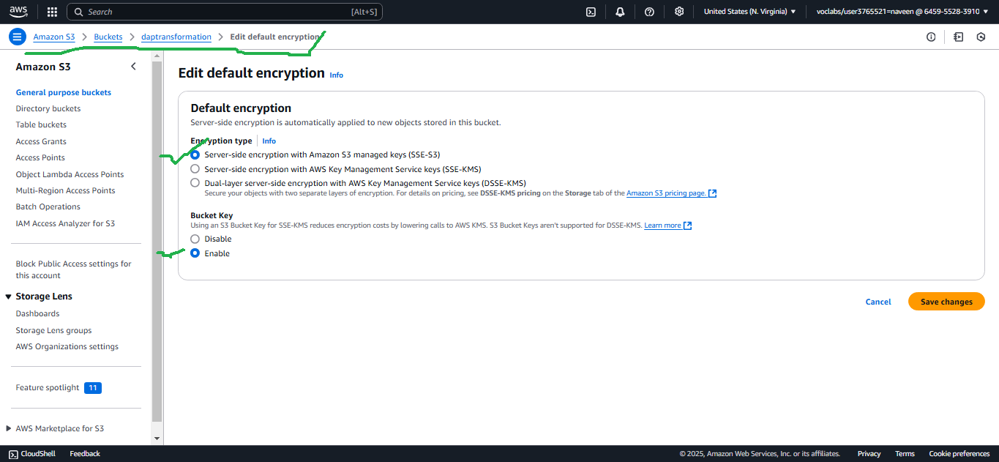
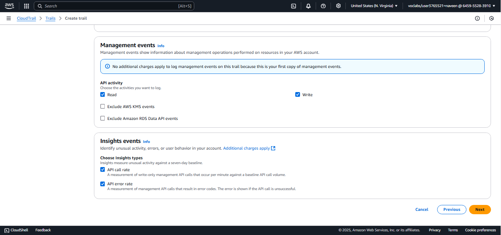

# My-Portfolio - Naveen
<h1>PART 1<h1>
<h3>Descriptive Analysis </h3>
<h3>Project Title:</h3> AWS Data Analytic Platform for The City of Vancouver “Phase 1
<h3>Project Description:</h3> Descriptive Analysis of the City of Vancouver's Capital Budget and Funding Allocations.
<h3>Objective: </h3>In this assignment, I will be migrating the existing data to AWS to develop a data analytics platform for the City of Vancouver. To create and construct the data analysis platform for this project, I used the dataset named "2023-2026-capital-plan-and-2025-capital-budget-with-proposed-four-year-capital-0." This data contains City of Vancouver financial information including the services offered categories, programs pursued names, and capital budgeting plans for different periods. The main purpose of this Amazon AWS project is to help the city access the data, conduct analysis for capital budgeting and be able to make data-driven decisions. To achieve the assignment objective, I will create an Amazon AWS S3 buckets, where the data will be store, cleaned, catalogued, and analyzed.
<h3>Dataset:</h3> The dataset consists of budgetary data for capital projects in Vancouver, with key features including:
Project Category: Infrastructure, parks, transportation, etc. Budget Allocation Year: 2023, 2024, 2025, 2026.
Funding Sources: External funding, reserves, or city revenues. 
Cost: Estimated costs associated with specific initiatives. Funding distribution across different areas of the city.
This task will have five major steps including data ingestion, data profiling, data cleaning, data cataloging and summarization.
<h3>Descriptive Analysis</h3>
What is the relationship between the major categories of expenditure in the capital budget? To identify the key sectors or areas receiving allocations and their respective proportions of the total budget. From Our draw.io diagram, we have our workflow and data plan. The figure represents the resources I utilize for this project to perform different functions:
The “Amazon S3” buckets represent the buckets. These are the main folders in Amazon AWS where our data is stored. We can have one Amazon S3 instance but have different folders and store data files within these folders. The data can then be accessed from different points and tools within Amazon to perform different functions.
AWS Glue DataBrew is a tool used for preparing data. DataBrew is normally preferred because it has a visual interphase where users can easily conduct their data analysis on complex datasets. The main function of AWS Glue DataBrew is to clean and normalize data, preparing it for an analysis.
  
Source: https://drive.google.com/file/d/1LcESLFIcRjCoWeF8RyF2KWsnHalWAjng/view?usp=sharing
AWS Glue, as I understand it, is an ETL tool, used to transform data and transfer it to our preferred destination. AWS Glue is a separate tool from Glue DataBrew. ETL means Extract, Transform, Load.
<h3>Step 1: Data Ingestion</h3>
In this step, I created two Amazon S3 buckets to store the data set up a dedicated storage system, and ensure the raw data remains unaltered for reproducibility. The objective of this step is to bring data into a central location for storage and later be used for analysis. The original data bucket (vancouverdap) was used to store the raw, unaltered dataset. Creating an original data bucket ensures the raw dataset remains accessible for reference or reprocessing as shown in Figure 1.    
  
Figure 1 Creation of Raw Data Bucket
I also created another S3 bucket and named it “daptransformation” to store clean data after transformations. This ensures that we have a clear distinction between original and transformed datasets. Figure 2 shows the creation of “daptransformation” with its contents. I will be uploading the original data to the buckets, and then the successive data will be created and stored separately for easy identification and to have separate layers of data.
Figure 2 Creation of "daptransformation"
  
Figure 3 Standard Storage Class
I selected the standard storage class because the data will be frequently accessed. S3 Standard also guarantees low latency and high throughput, which is important for data transformation. Furthermore, it is fully elastic as it automatically grows and shrinks as you add and remove data.
<h3>Methodology:</h3>
1-	Data Collection and Preparation:
o	Load budget data into AWS S3 for centralized access.
o	Use AWS DataBrew for data profiling and initial cleaning to remove duplicates, handle missing values, and correct data types.
2-	Descriptive Statistics:
o	Summarize total and average costs per category.
o	Analyze year-wise allocation trends and major funding sources.
3-	Data Visualization:
o	Create Bar Charts: Show year-wise changes in funding across project categories.
o	Pie Charts: Display the proportion of funding from different sources.
o	Heatmaps: Illustrate regional differences in budget distribution.

4-	Customer Segmentation:
o	Segment customers based on their purchasing behavior (e.g., high-frequency vs. low-frequency buyers).
o	Analyze the purchasing patterns of different segments.
5-	Insights and Findings:
o	Summarize the insights derived from the analysis, highlighting:
	Peak shopping periods (e.g., holidays, weekends)
	Trends in product category sales over time
	Preferences in payment methods across customer segments
6-	Recommendations:
o	Provide actionable recommendations based on the findings to inform inventory management, targeted marketing campaigns, and promotional strategies.
<h3>Tools and Technologies:</h3>
•	Python (Pandas, Matplotlib, Seaborn) or Excel for data analysis
•	Data visualization tools (Tableau or Power BI) for creating dashboards
<h3>Deliverables:</h3>
•	A detailed report summarizing the methods, findings, and recommendations.
•	Visualizations and dashboards to present key insights clearly.
•	A presentation for stakeholders to communicate important findings and suggestions for future action.
This descriptive analysis project aims to provide a comprehensive understanding of customer purchase behaviors, enabling XYZ Retail to optimize its operations and enhance customer satisfaction.
This analysis enabled the City of Vancouver to understand critical patterns in its budget allocations. Using AWS services for storage, profiling, and processing ensured a streamlined and secure approach, while advanced visualization tools made the insights actionable for stakeholders. This project highlights the potential for data-driven decisions to enhance urban planning and resource management.

<h2>Diagnostic Analysis </h2>
<h3>Project Description:</h3>
Diagnostic Analysis of Budget Allocation Changes in the City of Vancouver 
<h3>Project Title: </h3>
Investigating the Causes of Budget Variations in Vancouver’s Capital Plan
<h3>Objective:</h3> The primary goal of this project is to conduct a diagnostic analysis to identify the underlying causes of variations in budget allocations across different regions and categories in the City of Vancouver’s 2023–2026 Capital Plan and 2023 Capital Budget. By analyzing diverse datasets, we aim to uncover factors influencing these variations and provide actionable insights to inform more effective financial strategies.
<h3>Background:</h3> Over recent budget cycles, the City of Vancouver has observed notable shifts in capital allocations, raising concerns about alignment with urban priorities such as housing, infrastructure, and sustainability. Management seeks a thorough understanding of the drivers behind these changes to ensure the budget reflects the city’s strategic goals.
<h3>Dataset: </h3>The analysis leverages multiple datasets, including:
Budget Data: Yearly allocations across categories such as housing, transportation, and parks.
Demographic Data: Regional population density, growth trends, and socio-economic profiles.
Impact Data: Outcomes of previously funded projects, such as usage rates or community benefits.
Market and Economic Data: Regional economic indicators and trends affecting funding decisions.
<h3>Methodology:</h3>
1-	Data Collection and Preparation:
o	Consolidate datasets from various sources, including Vancouver's Open Data Portal and external economic reports.
o	Clean and normalize data to ensure consistency for analysis.
2-	Trend Analysis:
o	Perform year-over-year comparisons of budget allocations across regions and categories.
o	Identify key areas with significant increases or decreases in funding.
3-	Correlation Analysis:
o	Assess relationships between budget variations and external factors such as population growth, project outcomes, and economic conditions.
o	Apply statistical methods (e.g., regression analysis) to measure the influence of these variables on budget changes.
4-	Root Cause Analysis:
o	Engage city officials and stakeholders through interviews to gather qualitative insights on shifts in priorities.
o	Use diagnostic tools like the "5 Whys" or Fishbone Diagram to systematically investigate underlying causes.
5-	Segmentation Analysis:
o	Segment regions and project categories based on funding levels and demographic factors.
o	Analyze how resource allocation impacts different community groups.
6-	Synthesis of Findings:
o	Combine quantitative and qualitative insights to identify the primary drivers of budget variations.
o	Highlight patterns and inconsistencies in allocation practices.
<h3>Tools and Technologies:</h3>
•	SQL for data extraction and preprocessing.
•	AWS Services:
•	AWS DataBrew for data profiling and cleaning.
•	AWS Glue for ETL pipeline execution.
<h3>Deliverables:</h3>
•	A comprehensive diagnostic report that outlines the analysis process, findings, and confirmed root causes of the sales decline.
•	Visualizations and dashboards summarizing key metrics and trends.
•	Actionable recommendations for management, focusing on strategies to address identified issues and improve sales performance.
•	maintain a clear separation between raw and transformed datasets. 

<h3>Step 3: Data Profiling</h3>
To understand my dataset and decide what type of data preparation steps I might want to run, I conducted a data profiling operation. This was done using the default DataBrew settings. I created an AWS DataBrew project named "vancouverdap-profile” and linked it to the raw dataset I created in the beginning (See Figure 4). It is this data that will be cleaned using different data cleaning jobs and data profiles to have the final data for our analysis.
  
 
Figure 4 Profile Creation
Inside the project, they ran a profiling task called “vancouverdap-profile job” to analyze the dataset. This profile job was meant to analyze the dataset to understand its structure, data types, statistics, and potential quality issues, offering important insights that will help in deciding on further data cleaning, transformation, and preparation steps before using the data in or analysis. The figure below gives a summary of our data, with a total of 362 rows, and 17 columns. The data has 11 integer columns and 5 string columns. We also have 60 missing cells. This gives us a hint as to what should be done during data cleaning so the recipe jobs are created for the same.
  
Figure 5 Data Types
The results show that 99% of the dataset are valid cells with 100% of the rows being valid rows. We also did a correlation to have a better understanding between the data variables.
  
Figure 6 Correlations
Understanding the relationships between the variables enables us to identify key patterns or redundancies.
  
Figure 7 Value Distribution
  
Figure 8 Columns Summary
<h3>Step 3: Data Cleaning</h3>
Still in the AWS Glue DataBrew, I created a cleaning recipe to address issues identified in Step 2. The first cleaning action was renaming columns for better clarity and standardization. I then deleted special characters such as “,,” and “,” and white spaces.  Further changed the names of the columns to make it easy to identify and read the columns.
  
<h2>Data Wrangling </h2>
<h3>Project Description: </h3>Data Wrangling for Budget Analysis at the City of Vancouver 
<h3>Project Title: </h3>
Data Wrangling for Enhanced Budget and Funding Insights
<h3>Objective:</h3> The primary goal of this project is to perform comprehensive data wrangling on the City of Vancouver’s 2023–2026 Capital Plan and 2023 Capital Budget datasets. By cleaning, transforming, and consolidating data, the project aims to prepare a high-quality dataset that provides actionable insights for budget allocation and planning.

<h3>Background:</h3> The City of Vancouver's budgeting process involves multiple datasets, including funding sources, project costs, and allocations across years and categories. However, the raw data often contains missing values, inconsistencies, and formatting issues, making it challenging to derive meaningful insights. This project focuses on preparing clean, consistent data for subsequent analysis and reporting.
<h3>Dataset:</h3> The datasets used in the wrangling process include:
Capital Budget Data: Allocations for infrastructure, parks, housing, and transportation.
Funding Sources: Details of external and internal funding contributions.
Regional Allocations: Distribution of funds across different areas of Vancouver.
<h3>Methodology:</h3>
1-	Data Collection:
o	Load raw budget data into AWS S3 for centralized storage and access.
Ensure all relevant datasets are available, including funding and regional data
The figure below presents our recipe job, which specifically helped in renaming the columns and removing special characters from the data.
  
Here is the data lineage, which shows our AWS S3 flow, from the dataset, and recipe job, and to have better data, which is stored in our S3 folder created earlier.
  
 
<h2>Exploratory Data Analysis</h2>
<h3>Project Description:</h3> Exploratory Data Analysis (EDA) on Titanic Dataset
<h3>Project Title:</h3> Surviving the Titanic: An Exploratory Data Analysis
<h3>Objective:</h3> The primary objective of this project is to analyze the City of Vancouver's 2023-2026 Capital Plan and 2023 Capital Budget datasets to uncover patterns and trends in budget allocation. By examining various budget categories, such as infrastructure, parks, and transportation, we aim to understand the city's financial priorities and provide actionable insights to improve decision-making and urban planning.
<h3>Dataset:</h3> The dataset consists of budgetary data from the City of Vancouver, including details such as:
Capital Category: Key areas of budget allocation (e.g., housing, transportation, parks).
Project Description: Details about funded projects.
Estimated Cost: Total cost associated with each project.
Funding Source: Sources contributing to the budget (e.g., reserves, external funding).
Allocation Year: Year-by-year budget allocation across categories.
<h3>Methodology:</h3>
1-	Data Collection and Preparation:
•	Load the budget data into Amazon S3 for centralized storage.
•	Use AWS DataBrew for data profiling and initial cleaning, such as handling missing values and renaming columns for consistency.
2-	Descriptive Statistics:
o	Generate summary statistics for budget categories to identify key trends (e.g., top-funded areas).
o	Calculate total and average funding across years for each capital category.
3-	Data Visualization:
o	Create visualizations to illustrate key insights:
	Histograms and Boxplots: Analyze the distribution of continuous variables like Age and Fare.
	Bar Charts: Showcase survival rates across different categories (e.g., Sex, Pclass).
	Heatmaps: Visualize correlations between numerical variables.
4-	Survival Analysis:
o	Compare survival rates:
	Create visualizations to highlight budget trends and priorities:
	Bar Charts: Show budget allocations by category and year.
	Pie Charts: Illustrate proportions of funding sources.
	Heatmaps: Highlight correlations between categories and funding levels.
5-	Insights and Findings:
o	Identify major areas of spending and how they align with the city's priorities (e.g., housing and community infrastructure).
o	Examine changes in allocation over the years to assess evolving priorities.
6-	Conclusion:
o	Provide recommendations for optimizing budget allocations to address emerging urban challenges, such as population growth and sustainability.
<h3>Tools and Technologies:</h3>
•	AWS S3: Centralized data storage for raw and cleaned datasets.
•	AWS DataBrew: Data profiling and cleaning.
•	Python (Pandas, Matplotlib, Seaborn): Descriptive statistics and data visualization.
•	Tableau: Advanced dashboards and visualization for stakeholders.
<h3>Deliverables:</h3>
•	A detailed report summarizing budget trends and insights.
•	Dashboards and visualizations to present key findings clearly.
•	Recommendations for the city’s future budgeting strategies.
•	A detailed report summarizing the project’s methodology, findings, and recommendations.
•	Dashboards for visualizing key metrics, such as budget distribution by category and region, funding trends, and allocation variances.

<h2>Exploratory Data Analysis</h2>
<h3>Project Description:</h3> Exploratory Data Analysis (EDA) on Titanic Dataset
<h3>Project Title:</h3> Surviving the Titanic: An Exploratory Data Analysis
<h3>Objective: </h3>The primary objective of this project is to analyze the City of Vancouver's 2023-2026 Capital Plan and 2023 Capital Budget datasets to uncover patterns and trends in budget allocation. By examining various budget categories, such as infrastructure, parks, and transportation, we aim to understand the city's financial priorities and provide actionable insights to improve decision-making and urban planning.
<h3>Dataset: </h3>The dataset consists of budgetary data from the City of Vancouver, including details such as:
Capital Category: Key areas of budget allocation (e.g., housing, transportation, parks).
Project Description: Details about funded projects.
Estimated Cost: Total cost associated with each project.
Funding Source: Sources contributing to the budget (e.g., reserves, external funding).
Allocation Year: Year-by-year budget allocation across categories.
<h3>Methodology:</h3>
7-	Data Collection and Preparation:
•	Load the budget data into Amazon S3 for centralized storage.
•	Use AWS DataBrew for data profiling and initial cleaning, such as handling missing values and renaming columns for consistency.
8-	Descriptive Statistics:
o	Generate summary statistics for budget categories to identify key trends (e.g., top-funded areas).
o	Calculate total and average funding across years for each capital category.
9-	Data Visualization:
o	Create visualizations to illustrate key insights:
	Histograms and Boxplots: Analyze the distribution of continuous variables like Age and Fare.
	Bar Charts: Showcase survival rates across different categories (e.g., Sex, Pclass).
	Heatmaps: Visualize correlations between numerical variables.
10-	Survival Analysis:
o	Compare survival rates:
	Create visualizations to highlight budget trends and priorities:
	Bar Charts: Show budget allocations by category and year.
	Pie Charts: Illustrate proportions of funding sources.
	Heatmaps: Highlight correlations between categories and funding levels.
11-	Insights and Findings:
o	Identify major areas of spending and how they align with the city's priorities (e.g., housing and community infrastructure).
o	Examine changes in allocation over the years to assess evolving priorities.
12-	Conclusion:
o	Provide recommendations for optimizing budget allocations to address emerging urban challenges, such as population growth and sustainability.
<h3>Tools and Technologies:</h3>
•	AWS S3: Centralized data storage for raw and cleaned datasets.
•	AWS DataBrew: Data profiling and cleaning.
•	Python (Pandas, Matplotlib, Seaborn): Descriptive statistics and data visualization.
•	Tableau: Advanced dashboards and visualization for stakeholders.
<h3>Deliverables:</h3>
•	A detailed report summarizing budget trends and insights.
•	Dashboards and visualizations to present key findings clearly.
•	Recommendations for the city’s future budgeting strategies.
•	A detailed report summarizing the project’s methodology, findings, and recommendations.
•	Dashboards for visualizing key metrics, such as budget distribution by category and region, funding trends, and allocation variances.

<h3>Step 4: Data Cataloging</h3>
A data catalog is an inventory of all the data that I have collected and processed. The catalog organizes and classifies the data to support governance and data discovery. It improves operational efficiency through context-sharing since anybody can quickly understand why and how a specific dataset is used within the organization.
The data is further mapped in a visual frame to illustrate the web and connection to datasets.
The data cataloging is completed in Amazon AWS Glue. Specifically using VisualETL.
I have named my job as “Naveen Job”
  
After creating my job, it is time to add the nodes. My nodes include The data source, which is Amazon s3. I connect my data to the datasource. (Remember our cleaned data named “daptransformation”).
Once we connect our data, we are able to preview the data as can be seen in the next figure:
  
The next step is to create the other nodes, for cleaning our data, these include dropping the duplicates, and dropping null fields from our tables. Note that I connect each of these to our Amazon instance s3. Here are our pipelines:
  
To clean this data further, I have also created recipes node. The recipes will help in renaming the column headers, and further cleaning the database.
  
Data preparation recipe added:
  
Authoring the recipes:
  
Here are the recipes list created for our data job:
  
It is now to run our job. The job has been run successfully, as can be seen on the next image:
  
Here is the final pipeline:
  

Step 5: Data Summarization
  
The graph shows a visual bar graph of our data, with most frequent to least frequent. This order could denote the urgency of a category or the importance of the category that needs to be given by the city management.
The next visualization represents top distinct values, with Parks & public being the most valid, followed by streets, and community facilities. The least valid are civic facilities and equipment, and others.
  
 
 
The correlation matrix displays the relationships between different versions and elements of a 2023-2026 Vancouver capital plan.  The coefficients range from -1 (perfect negative) to 1 (perfect positive), with 0 suggesting no linear relationship. There are multiple strong positive relationships (> 0.60) between many of the plans. This indicates a great level of similarity and consistency in the plans' composition.  Some correlations are weaker (<0.30), especially between the original plan and changes to the plan. This suggests that the changes were not as comprehensive as the revised plans. A few coefficients are close to zero, implying little to no linear correlation between those specific plan aspects or versions. The absence of strong negative correlations implies that the revisions are built upon the original plan and do not contradict it.

<h3>Tools and Technologies:</h3>
•	AWS S3: Centralized data storage.
•	AWS DataBrew: Data profiling and cleaning.
•	Python (Pandas, NumPy): Data manipulation and transformation.
•	SQL: Data extraction and preparation from relational sources.
•	Visualization Tools (Matplotlib, Seaborn): Validation and insights during the wrangling process.
<h3>Deliverables:</h3>
•	A cleaned, transformed dataset ready for analysis, available in both CSV and Parquet formats.
•	A comprehensive report documenting the data wrangling process, including challenges, methods, and final dataset characteristics.
•	Visualizations demonstrating data quality checks and key transformations.
<h3>Timeline:</h3>
•	Weeks 1–2: Data collection and profiling.
•	Weeks 3–4: Cleaning and transformation.
•	Weeks 5–6: Consolidation, validation, and documentation.
This data-wrangling initiative ensures that the City of Vancouver has a high-quality, consolidated dataset for capital budget analysis, enabling better resource allocation and financial planning for infrastructure, housing, and transportation projects.

<h1>PART 2</h1>
<h3>Introduction</h3>
For Part 2 of the DAP Design and Implementation assignment, I will conduct data analysis, implement security measures for my data, establish a data governance system, and monitor my data. I will present this in five major parts, concluding with a summary.
In Part 2 of the assignment, I continued with my bucket and data I used in Part 1, migrating The City of Vancouver to AWS.
<h2>Data Quality Control</h2>
<h3>Project Title:  </h3>
AWS Data Analytic Platform for The City of Vancouver
<h3>Project Description: </h3>
Data Quality Control Initiative for the City of Vancouver. Implementation of Data Quality Control Measures for the City of Vancouver’s Budget 

<h3>Objective: </h3>
Primary objective of this project is to establish a comprehensive Data Quality Control (DQC) framework to ensure the accuracy, completeness, consistency, and reliability of the City of Vancouver’s capital budget and funding datasets. This framework aims to enhance data-driven decision-making, improve operational efficiency, and ensure compliance with governance and reporting standards.
<h3>Background</h3>
As the City of Vancouver expands its urban projects and services, maintaining high data quality is critical for financial planning and transparency. Issues such as missing values, duplicate records, and inconsistent formats can undermine trust and lead to inefficiencies. This project addresses these challenges by implementing robust data quality control processes to improve dataset reliability and usability for stakeholders.
<h3>Scope</h3>
The project focuses on the following areas:
Data Profiling: Analyze datasets for quality metrics, such as completeness and validity.
Data Cleansing: Eliminate errors, duplicates, and inconsistencies in budget and funding datasets.
Data Validation: Establish validation rules to ensure integrity during data entry and processing.
Monitoring and Reporting: Implement real-time monitoring and reporting of data quality metrics.
Training and Awareness: Educate staff on data quality best practices to foster accountability and consistency.
<h3>Methodology:</h3>
Current State Assessment:
Analyze the current state of budget and funding data.
Identify key challenges impacting data quality, such as incomplete records or inconsistent formats.
Data Profiling:
Use AWS DataBrew and other profiling tools to assess datasets, focusing on:
Completeness: Identify missing values in critical fields.
Consistency: Detect formatting issues across datasets.
Validity: Ensure values conform to expected ranges and formats.
Establish Data Quality Metrics:

Define Key Performance Indicators (KPIs) such as:
Error rates in budget categories.
Frequency of duplicate records.
Compliance with defined standards for funding allocation data.
Data Cleansing Processes:

Remove duplicate and erroneous records.
Standardize field formats (e.g., funding source names and project IDs).
Use imputation techniques to address missing values based on historical data or logical assumptions.
Validation Rules and Procedures:

Define and implement rules for real-time data validation during entry and processing to minimize errors.
Develop user guidelines for consistent and accurate data entry.
Monitoring and Reporting:

Create monitoring dashboards using Tableau or Power BI to visualize data quality metrics.
Schedule periodic reports summarizing trends and performance against KPIs.
Training and Best Practices:

Develop training materials and workshops on maintaining high data quality standards.
Foster a culture of accountability for data integrity.
Feedback Mechanism:

Establish a process for continuous improvement based on user feedback and observed data issues.
<h3>Tools and Technologies</h3>
AWS DataBrew: For data profiling and cleaning processes.
Python: To create automated validation scripts and advanced data cleaning workflows.
SQL: For querying and cleaning data stored in relational databases.
Tableau or Power BI: For monitoring and visualizing real-time data quality metrics.
<h3>Deliverables</h3>
A comprehensive Data Quality Control plan outlining all processes, metrics, and responsibilities.
Cleaned and validated budget datasets ready for analysis and reporting.
Training materials and workshops to educate stakeholders on data quality principles.
A monitoring dashboard to track data quality metrics in real-time.
Documentation of all implemented processes, challenges, and improvements.
<h3>Timeline</h3>
Weeks 1–2: Current state assessment and data profiling.
Weeks 3–4: Establishing metrics and cleansing processes.
Weeks 5–6: Implementing validation rules and monitoring tools.
Weeks 7–8: Training staff and deploying monitoring dashboards.
<h3>Outcome</h3>
This Data Quality Control initiative ensures the City of Vancouver has accurate and reliable datasets for budget planning and governance. By addressing data inconsistencies and enhancing monitoring capabilities, the project supports efficient resource allocation, transparent reporting, and improved decision-making processes.
The figure below presents the AWS processes we carry out in the task:
Figure: Data Analytics Presentation
  
To Edit: https://drive.google.com/file/d/1jx6iyg7woYp4DOINRY5Lvq0naQ44Pih9/view?usp=sharing
<h3>Step 1: Data Analysis</h3>
In this section, I will be doing data enrichment by implementing a data catalog, which is a set of tables. I will be build database using AWS Glue application, which gives the public access to the County data. I will be specifically adopting crawlers for my S3 buckets to process and analyse my data and make it easily accessible to the users:
Figure: Getting Started Athena
  
 

First setting my query result location as s3://daptransformation/:
Figure: Athena Location Settings
  
Figure: Query Results and Encryption Settings Success
  
Figure: SQL Table Created
  
Figure: Athena with the query and result
  
<h3>Step 2: Data Security</h3>
I describe the procedures that I apply in providing security measures for my data in my S3 bucket in this section.  Naturally, when you login, all S3 buckets are private, meaning that only users who have been explicitly granted permission can access them (Mishra et al., 2022).  In my situation, I must provide the public with access to particular objects, as I want them to be able to view the County of Vancouver data.
 I will implement security measures for my current bucket, which was created in part 1 of the task, daptransformation.  I have four items in my bucket that require protection.
Figure: Bucket to be Secured
  
Figure: Bucket Data
  
My first security actions will be done in the “Permissions” tab.
  
My "Block Public Access" bucket settings are now disabled; therefore, this data is accessible to the whole public.  As a result, I must adjust the settings to allow the public to view specific items.  Thus, as seen below, I block the first two and leave the other two:
  
Encryption
Data encryption is the next crucial security measure to think about for my buckets. I have enabled the bucket key, selected Amazon SSE-S3 server-side encryption S3 keys, and navigated to the Properties tab in our bucket. I then scrolled down to the “Bucket Encryption” section and clicked the edit button to make changes.
  
I will leave my ACL settings as default because they seem to be correct.  The ACL defines the bucket's control.  I will continue to use the object ownership setting that is enforced.  Since I own the bucket, I am able to write and list the items.  I can also read and write ACL.  No user groups are allowed, no S3 log delivery group is created, and no public access rights are given.
  

<h3>Step 3: Data Governance</h3>
In this section, I demonstrate how I have implemented data governance using Datazone in Amazon AWS. I will govern data stored in S3 and Redshift through a series of configurations, outlining the most critical procedures for sharing and managing data.
Setting up DataZone
Configure the Admin and Visitor accounts with Redshift Serverless clusters.  Enabling database sharing between accounts requires this.
It is now time to begin the DataZone setup process.
Creating DataZone Account
The first process is to create a DataZone account. I will be using my current account. While logged in as administrator in the AWS console, in the navigation panel, go to DataZone, then click the button create domain:
Figure: Amazon DataZone Started Page
  
We are taken to a new page, where I fill in the information to create a domain:
•	Domain Name: My preferred domain name.
•	Description: Providing a brief description of my domain is optional.
•	Service access: This role is automatically created by DataZone to provide the necessary permissions. The service access grants the necessary permissions to make API requests on behalf of domain users for this role.
Figure: 
   
I choose to go with the Quick setup option because it automatically creates S3 bucket roles and requirements for DataZone.
  
I then choose "Create domain."  Then, "Open Data Portal" after the domain is created.
Connecting Admin and Visitor accounts:
To enable data synchronization and access across multiple AWS accounts, it is necessary to link my AWS accounts to the Domains we just created in DataZone.
To connect the accounts, under “Domains,” select “Account associations,” afterwars choose “Request associations.”
Then key-in the Admin account ID, then select “Request associations.” The exact process applies to connecting the Visitor account.
  
Creating Projects
For various business use cases, groups of users can collaborate on projects that calls for diverse data usage or consumption in the AWS DataZone catalog. I will design initiatives for officials and visitors alike. Select "Create Project" after logging in to the Data Portal. Click Create after you have given your project a name. To construct the Visitor project as Ill, repeat these steps.
  
 
After the projects are readily setup and the respective accounts are connected, I use the next steps to enable blueprints in both the Admin and Visitor accounts. Once it is done, I will go back to DataZone dashboard and start creatino of the required environments, publish and subscribe to data assets, and establish a business catalog.
Creating Environments:
I will Athena environment, which is linked to S3, and Redshift environment.
Athena Environment:
Navigate to the Environments page after selecting the Admin project and logging in to the Data Portal. Then clicking Create Environment to move forward.
  
After choosing DataLakeProfile as my profile and specifying the name, I the next button Create Environment.
After assigning a unique name to my environment, I click "Data Lake Profile" as the environment profile, then finish by clicking "Create Environment."
Redshift Environment:
My next step is to click Create Environment Profile, then I give the profile a name and select my blueprint at Data Default Warehouse. 
  
 
Under Parameter Set section, I pick my earlier created parameter set.
  
I then complete my configuration by clicking Create Environment Profile.
  
Admin and Visitor Account
Enable Blueprints:
The blueprint used to build the environment specifies the AWS applications I used (Redshift and/or Glue) that participants in the project may use when working with DataZone catalog assets.
Check out the DataZone resource. After selecting "View Associated Domain" navigate to Blueprints tab, enable the "DefaultDataLake" and "DefaultDataWarehouse" blueprints.
Create a Redshift Parameter Set:
To connect to my Redshift cluster and thereafter publish the data warehouse environments, DataZone requires a parameter set, which is a group of key-value pairs. The names of my database, secrets manager and Redshift cluster; holding cluster credentials—are among these options.
From the Parameter Sets menu, choose Create Parameter Set after selecting the Default Data Warehouse blueprints. Please select the area, then provide its name and a brief description. 
  
 
My preferred option is Amazon Redshift Serverless, the rial version. I pick the Secrets Manager ARN containing the Redshift Serverless workgroup or specified Redshift cluster access credentials. The AmazonDataZoneDomain:
The [Domain_ID] tag must be applied to the AWS secret in order for it to be used inside parameter set. Hit Create button to create a parameter set. Ensure that the Redshift Manage Access Role is granted permission to read the secret.
  
Repeat the earlier procedures in the customer account to duplicate the setting.
Creating Data product
For part 2 assignment, I have two datasets in the Admin account.
Claims: My dataset is kept on S3. The Glue Data Catalog is also used to catalog the data.
Visitor: I have a dataset in Redshift that includes relevant visitor and personal data.
I can import the data, classify it, and publish it now that the projects and environments are set up. I can then use the business name creation and glossary to make the data readily understandable.
Publish Claims data
Select "Create Data Source" from the Data Sources page after logging into the Data Portal. Pick AWS Glue as the type, give the data source a name, and select the environment you just created given that claims data is kept in S3.
  
In the following tabs, enter the name of the Glue database and use the default parameters. Click Create to finish the setting.
 
Once constructed, I run my Data Source so that DataZone may import the Glue catalog into the Data Portal. After the process is done, all imported asset will be visible on the portal.
  

 
Publish Visitor data
Under the Data Sources panel, when creating a new source of data, select Redshift as the data source type.
  
Leave the remaining options at their default settings, click Next, and provide the appropriate schema name. Launch the data source after choosing Create. When the run is complete, imported data is visible. The process is completed when you click on the asset and select "Publish."
  
After uploading both datasets, my next procedure is to subscribe using the Visitor account. You may use Redshift and Athena to analyze the data after subscribing.
Finding and signing up for a data product.
Through data searches, the data Visitor locates the information required for the organization use case. If the owner of the data gives approval for the subscription, the data analyst may use the data asset.
Claims data
Create subscription:
Locate the claims data using the search bar, and then select "Subscribe."
  
 
To see the subscription request notification, go to the Admin project. Click the button 'View Request' to check the information and provide your permission. I may also choose to allow 100% access to the data or use filters to give limited access to the data.
  

 
Analysing and Visualizing the data in Athena:
Go back to the Visitor project, and from here we can see the data I subscribed to.
  
Clicking on the visible data and choosing "Query Data" from the "My Subscription" page to see the data.
 
 
Customer data
Create subscription:
Repeat the steps to locate and subscribe to the visitor data (Kewate et al., 2022). Then go back to the Admin project to approve the data subscription request. Once the item has been approved, DataZone will incorporate it into the existing environment.
  
Analyzing and Visualizing Redshift Data
Clicking Query Data to run the appropriate queries on Redshift's visitors data.
 
Administrator user account should be used for authentication and database dev. From here I shouls be in a position to see a data zone schema with a view generated beneath it (Manchana, 2023).
This section on setting up data governance using AWS DataZone covered dataset generation, environment setup, and data access management. My ability to efficiently handle and analyze data has improved making decisions through big data. 
<h3>Step 4: Data Monitoring</h3>
AWS offers extensive monitoring features to keep track on the functionality and health of data systems.  Monitoring metrics and logs from AWS services is made possible via Amazon CloudWatch, providing real-time insight into system performance. These monitoring features make security analysis, troubleshooting, and 
While still in my daptransformation data bucket, I go to the Properties page.  Select Configure in CloudTrail from the AWS CloudTrail data events menu.  Next, set up Amazon S3 data events to be recorded in the trail by creating a new CloudTrail.
  
Figure: CloudTrail Management Console
  
Clicking create trail we have:
  
 
Gave it the name naveen-events.  I'm using the current bucket daptransformation once again.  My alias is naveen. The following graphic displays my naveen-events setups.
  
On the next page, I choose log events.   I simply want to monitor the management and insights events for the time being:
  
The following screen displays my settings for insights and management events.   For the management event, I'm monitoring read and write.   For Insight events, I'm monitoring the API call and error rates.
  
Our trail is now in place, and the bucket is being watched.
  
Turning on AWS S3 server access logging.
For security and access audits, I'll be utilizing the server access log.  I have activated my bucket daptransformation's access log.  Navigate to properties, server access logging, and then modify while in the bucket.
  
Figure:
  
In the figure below, the server access log is enabled for the bucket we are using daptransformation.
  
We are now monitoring the server access logs
  
 

